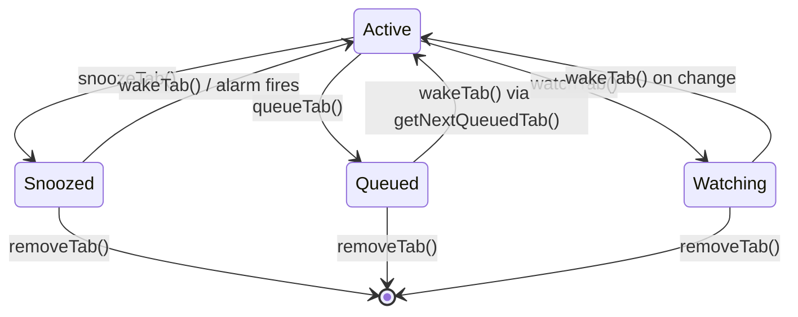

# Data Model

## Lifecycle Tab

The core data structure. Every snoozed, queued, or watched tab is stored as a `LifecycleTab`:

```typescript
interface LifecycleTab {
  id: string;              // UUID
  url: string;             // http/https only
  title: string;
  favIconUrl?: string;
  state: LifecycleState;   // "snoozed" | "queued" | "watching"
  createdAt: number;       // Unix timestamp (ms)
  originWindowId: number;  // Chrome window ID for restoration

  // Snoozed state
  wakeAt?: number;         // Unix timestamp when alarm fires

  // Queued state
  position?: number;       // Queue order (0-based)

  // Watching state
  cssSelector?: string;    // CSS selector for watched element
  pollIntervalMinutes?: number;  // Default: 30
  lastCheckedAt?: number;  // Last poll timestamp
  lastContentHash?: string; // SHA-256 of element textContent
  changedAt?: number | null; // When change was detected

  // Meeting mode
  meetingId?: string;      // Groups tabs snoozed together
}
```

## State Transitions



All transitions go through the lifecycle-manager module, which holds a mutex to prevent concurrent storage corruption.

## Storage Layout

### Chrome Storage (`chrome.storage.local`)

```json
{
  "lifecycle": [LifecycleTab, ...],
  "meetingMode": { "active": false, "meetingId": null },
  "attention": { "snoozesWoken": ["id1"], "watchesChanged": ["id2"] },
  "config": { ExtensionConfig }
}
```

### Bridge File Storage (`~/.tab-manager/`)

```
~/.tab-manager/
  config.json          # Server + extension config
  active-tabs.json     # Last synced active tabs
  lifecycle-tabs.json  # Lifecycle state (mirror of Chrome Storage)
  bridge.pid           # PID file for port management
  bridge.port          # Current port number
```

## Extension Config

```typescript
interface ExtensionConfig {
  thresholds: { warning: number; alert: number };
  staleMinutes: number;
  bridgeUrl: string;
  defaultPollIntervalMinutes: number;
  defaultSnoozeDurationMinutes: number;
}
```

## Tracked Tab (Active)

Active tabs are tracked in-memory by the service worker:

```typescript
interface TrackedTab {
  id: number;           // Chrome tab ID
  windowId: number;
  url: string;
  title: string;
  favIconUrl?: string;
  pinned: boolean;
  groupId: number;
  index: number;
  lastAccessed: number; // In-memory only, resets on SW restart
  createdAt: number;
}
```

!!! note "Ephemeral tracking"
    `lastAccessed` and `createdAt` for active tabs reset when the service worker restarts (MV3 service workers are ephemeral). This affects stale-tab detection accuracy but has no impact on lifecycle state, which is persisted in Chrome Storage.
