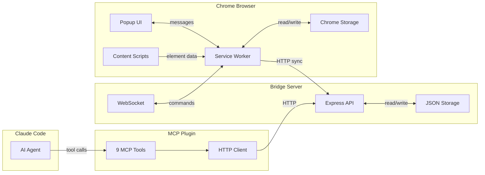

# Architecture Overview

Tab Lifecycle Manager is a monorepo with three packages that work together but are independently functional.

## System Diagram

## Data Flow

### Extension (Primary)

Chrome Storage is the source of truth. The service worker manages all state transitions through a mutex-protected read-modify-write pattern. The popup and options pages communicate with the service worker via `chrome.runtime.sendMessage`.

### Bridge (Sync/Backup)

Every minute, the extension syncs its state to the bridge via HTTP. The bridge stores a copy in JSON files at `~/.tab-manager/`. This enables MCP access without requiring the extension to be active.

The bridge also sends commands back via WebSocket (e.g., wake a tab from Claude Code).

### MCP (AI Interface)

The MCP plugin is a thin HTTP client over the bridge API. It exposes 9 tools that Claude Code can call to list, snooze, queue, watch, and manage tabs.

## Key Design Decisions

| Decision | Rationale |
|----------|-----------|
| Chrome Storage as primary | Extension works fully standalone without the bridge |
| Mutex on storage writes | Prevents race conditions from concurrent message handlers |
| Chrome Alarms for snooze | Survives service worker suspension, Chrome fires missed alarms on restart |
| CSS selector targeting | Users click to select what to watch, no manual selector writing |
| Content script extraction | Pages render in a real browser context, no fetch-based scraping |
| localhost-only bridge | Security boundary, prevents SSRF and data exfiltration |
| No authentication on bridge | Localhost-only + CORS origin check is sufficient for single-user |

## Security Model

- **URL validation**: all `chrome.tabs.create` calls are guarded by `isAllowedUrl()` (http/https only)
- **Bridge SSRF**: bridge URL restricted to localhost/127.0.0.1 in both extension and MCP
- **CORS**: bridge rejects requests from non-`chrome-extension://` origins
- **CSS.escape()**: selector generation escapes IDs and class names
- **textContent over innerHTML**: watch extraction uses text content to avoid processing scripts
- **Input validation**: bridge validates URLs, wakeAt timestamps, cssSelector length, tab payloads
