# Tab Lifecycle Manager

**Closing a tab doesn't mean losing it. It means telling the system what to do with it.**

Tab Lifecycle Manager is a Chrome extension + local server + MCP plugin that gives your browser tabs four lifecycle states: **Active**, **Snoozed**, **Queued**, and **Watching**. Instead of hoarding 100+ tabs as reminders, reading queues, and status dashboards, you manage them through explicit state transitions.

## How It Works

```mermaid
flowchart LR
    Start(( )) -->|Open tab| Active
    Active -->|Snooze| Snoozed
    Active -->|Queue| Queued
    Active -->|Watch| Watching
    Snoozed -->|Alarm fires| Active
    Queued -->|Pull next| Active
    Watching -->|Change detected| Active
    Active -->|Close| End(( ))

    style Active fill:#4CAF50,color:#fff,stroke:#388E3C
    style Snoozed fill:#FF9800,color:#fff,stroke:#F57C00
    style Queued fill:#2196F3,color:#fff,stroke:#1976D2
    style Watching fill:#9C27B0,color:#fff,stroke:#7B1FA2
    style Start fill:#333,stroke:#333
    style End fill:#333,stroke:#333
```



## The Four States

| State | What it means | How it returns |
|-------|--------------|----------------|
| **Active** | Open in the browser, business as usual | Already there |
| **Snoozed** | Tab closed, reopens at a scheduled time | Chrome Alarm fires, tab reopens automatically |
| **Queued** | Tab closed, waiting in an ordered list | You click "Next" when ready |
| **Watching** | Tab closed, extension polls for content changes | Notification when the watched element changes |

## Three Components

<div class="grid cards" markdown>

-   **Chrome Extension**

    ---

    Manifest V3 extension with popup UI, context menus, content scripts for element selection, and a service worker managing all lifecycle state.

    [:octicons-arrow-right-24: Extension docs](components/extension.md)

-   **Bridge Server**

    ---

    Local Node.js server providing REST API and WebSocket sync. Stores lifecycle state as JSON files for MCP access.

    [:octicons-arrow-right-24: Bridge docs](components/bridge.md)

-   **MCP Plugin**

    ---

    9 tools for Claude Code integration. List tabs, snooze, queue, watch, wake, meeting mode, stats, and AI suggestions.

    [:octicons-arrow-right-24: MCP docs](components/mcp.md)

</div>

## Meeting Mode

Snooze all unpinned tabs with one click. A blank tab stays in each window. When the meeting ends, all tabs restore to their original windows.

## Quick Start

```bash
# Install
git clone https://github.com/ugiordan/tab-manager.git
cd tab-manager && npm install

# Build and load extension
npm run build -w packages/extension
# Load packages/extension/dist/ in chrome://extensions (Developer mode)

# Start bridge (optional, for MCP access)
npm run bridge:start
```

[:octicons-arrow-right-24: Full installation guide](getting-started/installation.md)
